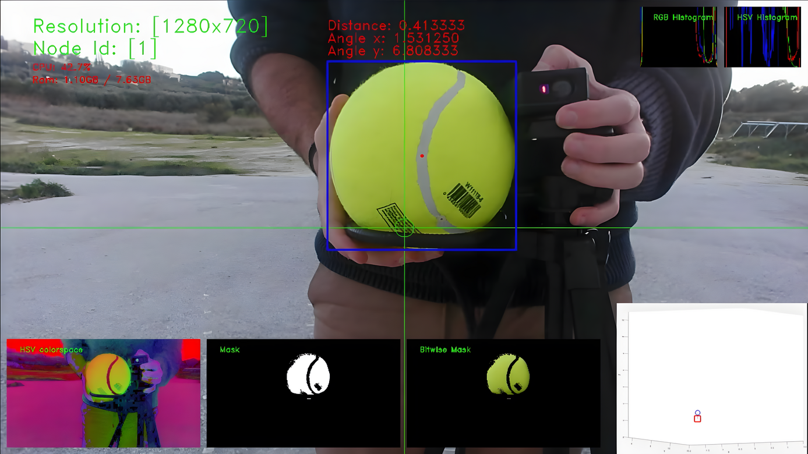
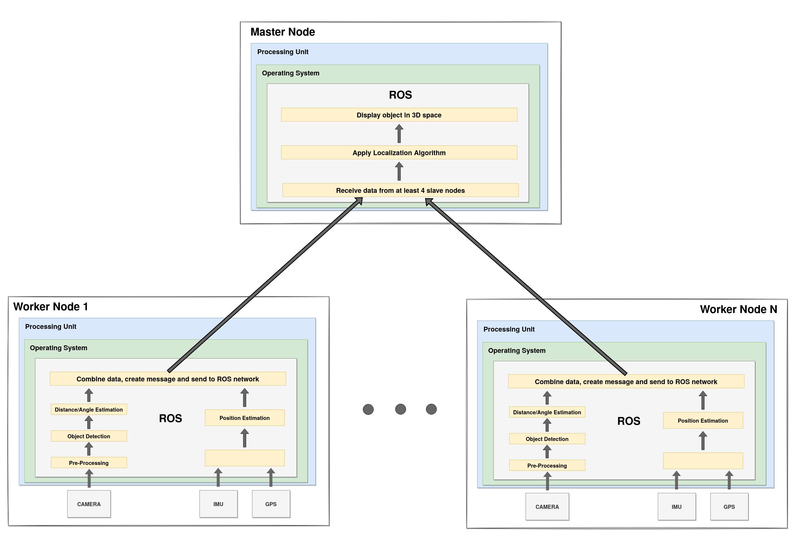
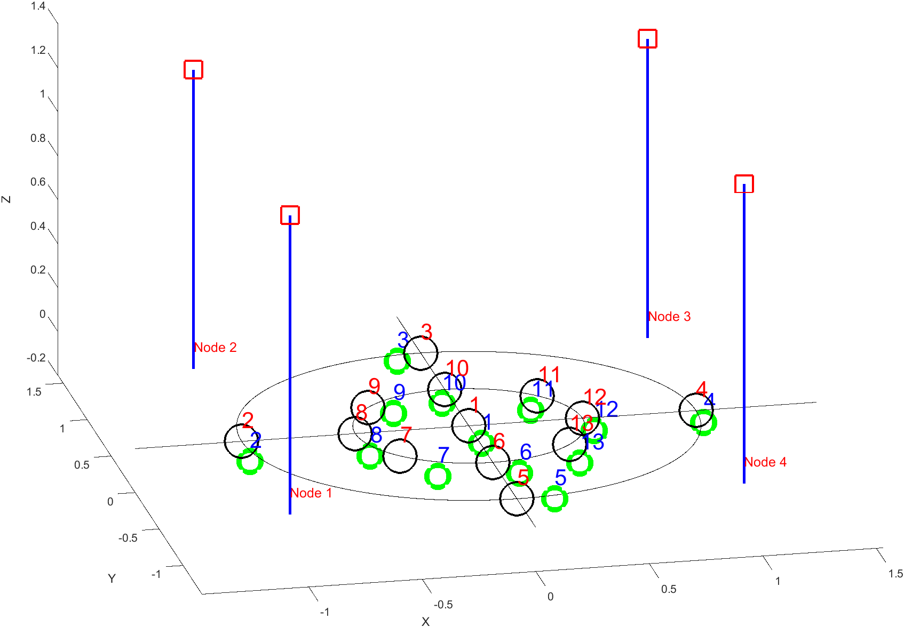
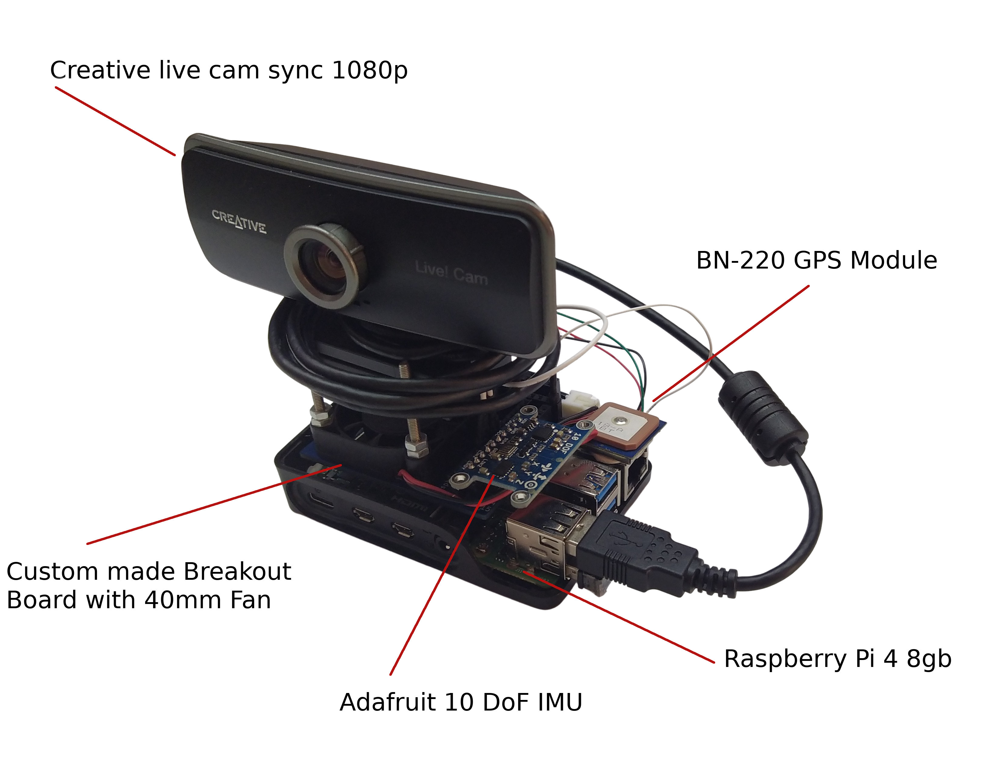

# ros_drone_swarm_mocap   

# Abstract
The requirement for object localization has existed for thousands of years, and over the past 70 years, we have even taken advantage of digital methods to achieve it. The following thesis focuses on the attempt to combine the above idea with the most advanced technology of UAVs and implement the first generation of a low-cost system for estimating the position of an object with the help of a swarm of drones. The prosecution of prior art research has distinguished the number of different methods already used in the literature to solve similar problems. In such methods, we often use Radio Frequencies - like GPS, WiFi, UWB, cellular, and Lora networks -, sound waves, or vision-related ones by operating cameras and LiDAR. It was also essential to understand the mathematical background behind these approaches and determine their complexities since the selection of the hardware for this kind of embedded systems often relies on the operating principles and resources that each one needs. These are related to how we calculate distances and angles by applying RSSI, TDoA, AoA, or even Stereo Vision techniques, and how we utilize this information in algorithms like Triangulation, Trilateration, or Hyperbolic Positioning to achieve localization. By comprehending each approach necessity, this work presents a two-tier system, in which worker nodes estimate the distance between the object of interest and camera through monocular vision and structure from reference. Then, through the principle of Multilateration, we finally achieve estimating its position by the system orchestrator node, called master. We first performed experiments in both indoor and outdoor scenarios from single worker nodes. Then, we used the data taken from the above procedure to simulate the operation of the entire proposed system. To complete this work, we also introduce a mechanism to estimate the ID of the detected object through frequency analysis of flashing led.

# System Overview
## Single node view

## Multiple nodes view

## System Architecture

## Position Estimations

## Proposed System

# Documents
* Init version of the technical specification document is available [here](doc/drone-mocap-technical-specs.pdf).
* High level documentation for the over all system (actually thesis document) is available through this [link](https://doi.org/10.26233/heallink.tuc.91531) as well as [here](doc/Design%20and%20Implementation%20of%20a%20Low%20Cost%20Embedded%20System%20for%20Localization%20of%20Drones%20Flying%20in%20Swarms.pdf).

# Tools used:
* Robot Operating System
* OpenCV
* Raspberry Pi
* IMU Module
* GPS Module
* KiCAD
* Matlab

