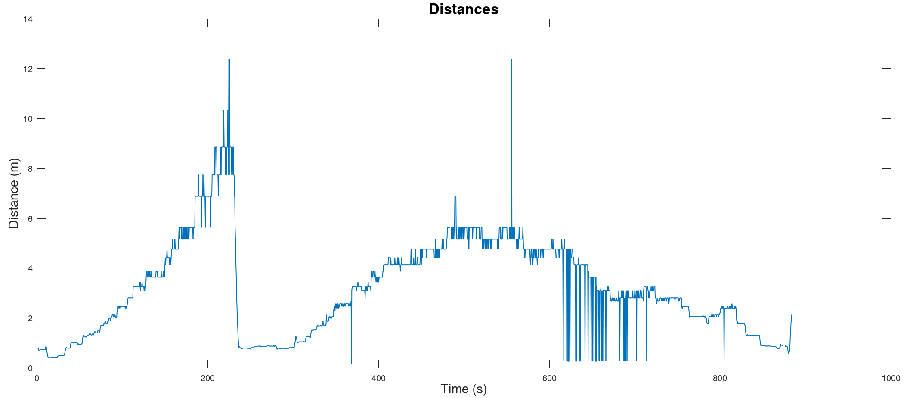

# ros_drone_swarm_mocap   

## Proposed system

  

## This is a 2-tier system

  

## Single worker node Distance and Angle Measurements

  
  

## Multiple nodes experiment

  
  
  

## Tools used:
* Robot Operating System
* OpenCV
* Raspberry Pi
* IMU Module
* GPS Module
* KiCAD
